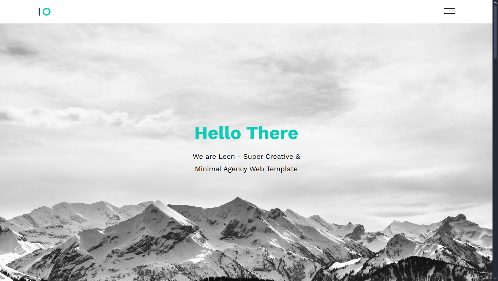

# HTML CSS Template One

This project is a responsive **HTML & CSS website template**. It
provides a modern layout with multiple sections such as landing,
services, portfolio, about, contact, and footer. It's designed as a
starter template for personal or business websites.

---

## 📂 Project Structure

    HTML-CSS-Template-One-main/
    ├── index.html              # Main landing page
    ├── css/                    # Stylesheets
    │   ├── global.css          # Global styling rules
    │   ├── variables.css       # CSS variables (colors, fonts, etc.)
    │   ├── header.css          # Header section
    │   ├── landing.css         # Hero/landing section
    │   ├── services.css        # Services section
    │   ├── portfolio.css       # Portfolio/projects section
    │   ├── about.css           # About section
    │   ├── contact.css         # Contact form section
    │   ├── features.css        # Features section
    │   ├── footer.css          # Footer section
    │   ├── components.css      # Shared reusable components
    │   ├── all.min.css         # Font Awesome icons
    │   └── normalize.css       # CSS normalization
    ├── images/                 # Image assets
    ├── webfonts/               # Font Awesome webfonts
    └── README.md               # Project documentation

---

## 🚀 Getting Started

1.  **Download or clone this repository**

    ```bash
    git clone https://github.com/yourusername/HTML-CSS-Template-One.git
    ```

2.  **Move to the project file**

    ```bash
    cd HTML-CSS-Template-One
    ```

3.  **Open the project folder and launch `index.html` in your preferred web browser**

That's it --- no installation or build steps needed.

---

## ✨ Features

- Responsive design for all screen sizes\
- Modular CSS structure for easy customization\
- Font Awesome integration for icons\
- Includes sections for:
  - Hero / Landing
  - Services
  - Portfolio
  - About
  - Contact
  - Footer

---

## 🛠️ Technologies Used

- **HTML5** -- Semantic structure\
- **CSS3** -- Styling and layout\
- **Font Awesome** -- Icons

---

## 📸 Preview



---

## 📌 Future Improvements

- Add JavaScript for interactivity
- Improve accessibility (ARIA roles, keyboard navigation)
- Dark mode support

---
